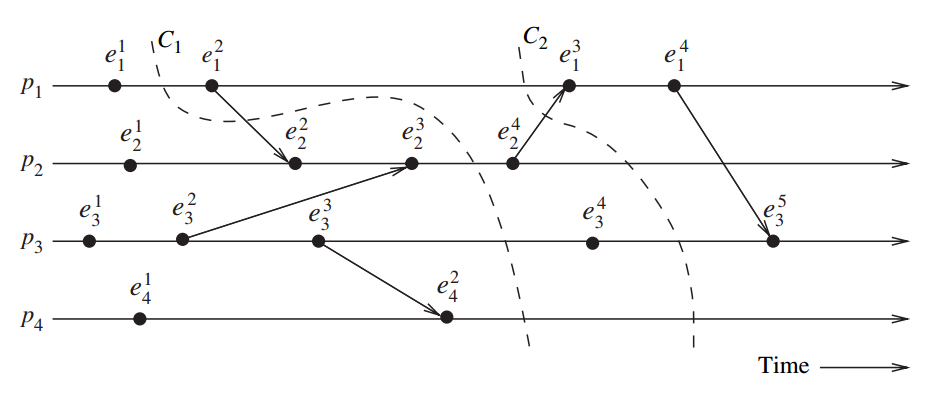
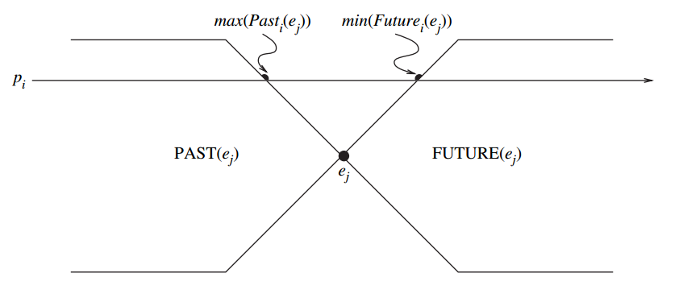
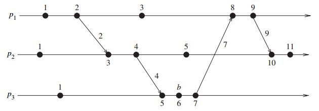
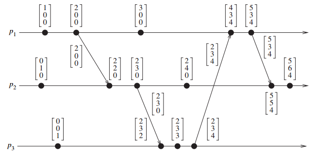
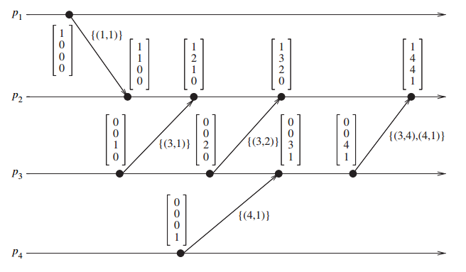
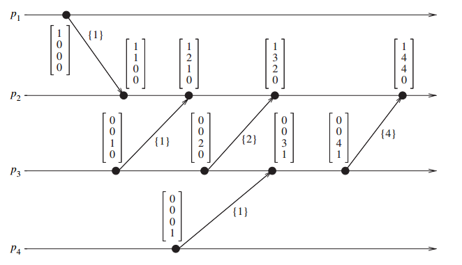
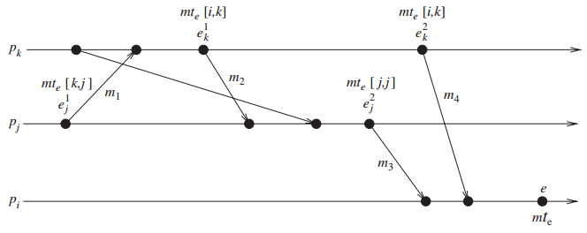

# 分布式计算 ——原理、算法与系统

# Distributed Computing —— Principles, Algorithms, and System

&nbsp;   

- [第一章 引言](#1)
- [第二章 分布式计算模型](#2)
- [第三章 逻辑时间](#3)
- [第四章 记录全局状态与快照算法](#4)
- 
- 

&nbsp;   

## 第一章 引言

分布式系统：处理器、存储器、通信网络

### 1.4 与并行多处理器/多计算机系统的关系

#### 并行系统：通过将计算任务在多个处理器之间进行分配，从而获得更高的吞吐率

- 多处理器系统
  - 互联网络：Omega网络、蝴蝶网络

> 图左是UMA（均匀存储器访问体系结构），右NUMA

- 多计算机并行系统
  - 处理器无法直接访问共享内存
  - 互联网络：环，超立方体

- 阵列处理器

#### 基于指令流和数据流的分类

### 1.5 消息传递系统与共享内存系统的对比

- 通过消息传递进行通信
- 通过共享内存通信

#### 在消息传递系统上仿真共享内存

每一个共享的位置可以建模为一个隔离的进程。

处理器间通过共享内存进行通信；计算机间使用消息传递进行通信。

### 1.6 分布式通信的原语

消息发送原语`Send()`， 消息接收原语`Receive()`。

`Send()`发送方式：缓冲（拷贝到内核缓冲区，再到网络）与 非缓冲（直接拷贝到网络）。

`Receive()`通常采用缓冲方式。

- 同步原语：如果`Send()`和`Receive()`两端都实现了握手，则原语是同步的
  - 只有调用者知道对应的`Receive()`原语被调用并且接收操作完成，`Send()`原语才算完成
  - 当数据拷贝到接收方的用户缓冲区时，`Receive()`原语被认为完成
- 异步原语：
  - 如果需要发送的数据被拷贝出用户缓冲区后，控制流程返回到调用进程，`Send()`原语被称为异步的
  - 异步的`Receive()`原语无意义
- 阻塞原语：如果一个原语的处理完成之后控制流程返回到调用进程，则一个原语被称为阻塞的
- 非阻塞原语：如果一个控制流程在调用原语之后立刻返回到调用进程，甚至这个操作尚未完成，则这个原语被称为非阻塞的

[怎样理解阻塞非阻塞与同步异步的区别？- 知乎](https://www.zhihu.com/question/19732473)

#### 处理器同步性

**同步屏障**：保证在所有处理器完成前面所分配的指令之前都不会去执行下一步的代码。

### 1.7 同步与异步执行

#### 异步执行

- 没有处理器的同步
- 消息延迟（传输+传播时间）是有限的
- 对于一个进程执行某一步任务没有时间上的上界限制

#### 同步执行

- 处理器之间同步
- 消息分发（传输+分发时间）能够在一个逻辑步或者轮次内完成
- 进程执行一步具有一个已知的上界

同步系统实际上是一个特殊的异步系统——所有的通信都在其发起的轮次内完成。

#### 1.7.3 仿真

在无错误的系统中，异步/同步 共享内存/消息传递 这4类程序可以互相仿真，即等价。

但是在有错误的系统中，情况并不是这样；一个同步系统相比于异步系统具有更高的可计算性。

### 1.8 设计主题与挑战

#### 1.8.1 系统角度

- 通信：远程过程调用、远程对象调用、面向消息的通信、面向流的通信
- 进程
- 命名：对于资源和进程的标识以及定位
- 同步：leader, logic clock
- 数据存储与访问
- 一致性与复本
- 容错

#### 1.8.2 算法角度

&nbsp;   

## 第二章 分布式计算模型

在分布式系统中，通信消息可能在传递过程中**乱序**、**丢失**、**受到篡改**或者**重复传递**。

分布式系统可以以一个有向图的方式建模，其中结点表示处理器而边则表示单向通信信道。

### 2.1 分布式程序

分布式程序有一组 $n$ 个异步进程 $p_1,\ p_2,\ ...,\ p_n$ 组成，令 $C_{ij}$ 表示从进程 $p_i$ 到进程 $p_j$ 的通信信道，$m_{ij}$ 表示由 $p_i$ 发往 $p_j$ 的消息。

- 假设每个进程都各自运行在不同的处理器上
- 进程间没有可共享的全局存储，而只能通过消息传递来进行联系
- 通信延迟是有限但无法预测的
- 这些进程不共享一个可随时访问的全局时钟
- 进程运行和消息传送是异步的

### 2.2 分布式运行模型

一个进程的运行可以描述为三类*原子*操作：**内部事件**、**消息发送事件**、**消息接收事件**。令 $e_i^x$ 表示进程 $p_i$ 上的第 $x$ 个事件。对一个消息 $m$，令 $send(m)$ 和 $rec(m)​$ 分别表示其发送和接收的消息。一个内部事件改变其所处的进程的状态，一个发送或接收事件改变双方的状态。

进程中的事件以出现顺序进行排序：$e_i^1,\ e_i^2,\ ...,\ e_i^x,\ ...$，该序列记为 $\mathcal{H}_i$：
$$
\mathcal{H}_i = (h_i, \to_i)
$$
其中 $h_i$ 是由 $p_i$ 产生的事件集合；二元关系 $\to_i$ 则定义了这些事件间的序。

关系 $\to_{msg}$ 表示因消息交换所导致的因果依赖关系：
$$
send(m) \to_{msg} rec(m)
$$

#### 1. 因果优先关系

令 $H = \bigcup h_i$ 表示在一次分布式计算过程中执行的时间集合。我们在集合 $H$ 上定义一个关系 $\to$，表示事件间的因果依赖关系。
$$
\begin{aligned}
\forall e_i^x, \forall e_j^y \in H, e_i^x \to e_j^y \Leftrightarrow 
\begin{equation}
\left\{
        \begin{array}                        \\
            (i = j) \wedge (x < y) \qquad\qquad\qquad or \qquad &\cdots\ same\ process\\
            e_i^x \to_{msg} e_j^y \qquad\qquad\qquad\quad\quad\ or &\cdots\ direct \\
            \exist e_k^z \in H: e_i^x \to e_k^z \wedge e_k^z \to e_j^y &\cdots\ indirect \\
        \end{array}
\right.
\end{equation}
\end{aligned}
$$
关系 $\to$ 是 Lamport 的 “happerns before” 关系。**如果 $e_i \to e_j$，则事件 $e_j$ 直接或间接依赖于 $e_i$**，存在着一条起始于 $e_i$，终止于 $e_j$ 的路径。

$e_i \nrightarrow e_j$ 表示事件 $e_j$ 不直接或间接依赖于 $e_i$，**即事件 $e_i$ 不会对 $e_j​$ 产生因果影响**。

**并发**：如果 $e_i \nrightarrow e_j$ 且 $e_j \nrightarrow e_i$，则事件 $e_i$ 和 $e_j$ 被称为是并发的，其关系被记为 $e_i || e_j$。

#### 2. 逻辑并发和物理并发

两个事件是*逻辑并发*的，当且仅当它们之间无因果影响。与此相对，*物理并发*的含义是不同事件在物理时间的同一时刻发生。不论一组逻辑并发的事件是否在物理时间上同时发生，也无论它们在物理时间上实际发生的顺序如何，都不会改变计算的结果。因此。虽然**一组逻辑并发的事件**可能不会在物理时间的同一时刻发生，但我们**总是假定这些事件在物理时间的同一时刻发生**。

### 2.3 通信网络模型

**因果依赖**（CO）：对任意两个消息 $m_{ij}$ 和 $m_{kj}$，假设 $send(m_{ij}) \to send(m_{kj})$，则 $rec(m_{ij}) \to rec(m_{kj})$。确保那些发往同一目标的因果依赖的消息，以符合它们之间因果依赖关系的顺序进行发送。

通信网络模型：CO $\subset$ FIFO $\subset$ 非FIFO（随机）

因果依赖模型提供了一个内在的同步机制。

### 2.4 分布式系统的全局状态

分布式系统的全局状态是所有 **处理器状态** 和 **信道状态** 的集合。

**处理器状态**：令 $LS_i^x$ 表示处理器 $p_i$ 在事件 $e_i^x$ 发生之后，以及事件 $e_i^{x+1}$ 发生之前的状态。特别地，$LS_i^0$ 表示 $p_i$ 的初始状态。

若 $y \le x$，记为 $e_i^y \le LS_i^x$，表示 $e_i^y$ 在处理器状态之内。

**信道状态**：记 $SC_{ij}^{x, y}​$ 表示信道 $C_{ij}​$ 的状态：
$$
SC_{ij}^{x, y} = \{ m_{ij}\ |\ send(m_{ij}) \le LS_i^x\ \land\ rec(m_{ij}) \nleq LS_j^y \}
$$
通俗地讲，信道是消息的集合。消息 $m_{ij}$，$p_i$ 在 $x$ 之内 send；$p_j$ 在 $y$ 之后 rec。即 $SC_{ij}^{x, y} = \{ m_{ij}\ |\ m_{ij}\ 从左穿过线段e_i^{x+1} e_j^y \}$

**全局状态**：$GS = \{\ \cup_iLS_i^{x_i},\ \cup_{j, k}SC_{jk}^{y_j, z_k} \} $

**一致性全局状态**：称 $GS$ 是一致的，如果满足
$$
\forall m_{ij}:\ send(m_{ij}) \nleq LS_i^{x_i} \Rightarrow m_{ij} \notin SC_{ij}^{x_i, y_j}\ \land\ rec(m_{ij}) \nleq LS_j^{y_j}
$$

> 这里中文书上写错了，第一个符号写成 $\le$

通俗地讲：$p_i$ 在 $x_i$ 之后的 send，那么必须有 $p_j$ 在 $y_j​$ 之后 rec。即
$$
\forall m_{ij}, m_{ij}\ 不能从右穿过线段e_i^x e_j^{y+1}
$$

**非中转全局状态**：所有信道为空

**强一致的全局状态**：一致且非中转的

### 2.5 分布式计算的运行分割

一条分割线 $C$ 将时空图分割为2各部分，$PAST(C)$ 表示分割线左边的所有事件的集合，$FUTURE(C)$ 表示分割线右边的所有事件的集合。

> $C_1$ 是非一致性分割线；$C_2$ 是一致性分割线

一致性全局状态对应一条分割线，其中每个 $PAST$ 集合中的 rec 事件都是在 $PAST$ 集中 send。

一条分割线是非一致性的，如果某个消息跨越了分割线从 $FUTURE$ 集传到 $PAST$ 集。

### 2.6 事件的过去和未来锥面

令 $Past(e_j)$ 表示在计算 $(H, \to)$ 中 $e_j$ 的过去事件。则，
$$
Past(e_j) = \{ e_i\ |\ \forall e_i \in H, e_i \to e_j \}
$$
记 $Past_i(e_j)$ 是进程 $p_i$ 上所有属于 $Past(e_j)$ 事件的集合。注意到 $Past_i(e_j)$ 是全序的，最大元素记为 $max(Past_i(e_j))$。注意到 $max(Past_i(e_j))$ 总是一个 send 事件。

令 $Max\_Past(e_j) = \bigcup_i \{ max(Past_i(e_j)) \}$，其包含每个进程上影响 $e_j$ 的最新事件，它被称为事件 $e_j$ 的过去锥面。

用反证法易知：$Max\_Past(e_j)$ 是一条一致性分割线。

类似地，事件 $e_j$ 的未来事件记作 $Future(e_j)$，它包含所有受到 $e_j$ 影响的事件 $e_i$，定义为
$$
Future(e_j) = \{ e_i\ |\ \forall e_i \in H, e_j \to e_i \}
$$
定义 $Future_i(e_j)$ 为进程 $p_i$ 上所有属于 $Future(e_j)$ 事件的集合。$min(Future_i(e_j))$ 作为 $p_i$ 上受 $e_j$ 影响的第一个事件。注意到 $min(Future_i(e_j))$ 总是 rec 事件。$Min\_Future(e_j)$ 定义为 $\bigcup_i \{ min(Future_i(e_j)) \}$，它包含了每个进程上受到事件 $e_j$ 影响的第一个事件的集合，被称为事件 $e_j$ 的未来锥面。易证它是一条一致性分割线。

在一个计算 $H$ 中，一个事件 $e$ 与 $e_j​$ 是**并发**的，当且仅当
$$
e \in H - Past(e_j) - Future(e_j)
$$

### 2.8 本章小结

进程间的消息交换显示出进程间的信息流向并且建立了进程间的因果依赖关系。进程间的优先因果关系由 Lamport 的 *hanppens-before* 关系确定。

&nbsp;   

## 第三章 逻辑时间

逻辑时间系统由一个**时间域** $T$ 和一个**逻辑时钟** $C$ 组成。$T$ 的元素形成关系 $<$ (*happens-before*) 上的**偏序**集合。逻辑时钟 $C$ 是一个函数，把事件 $e$ 映射到时间域 $T$ 中的一个元素，表示为 $C(e)$ 且成为 $e$ 的时间戳，定义为
$$
C:H\mapsto T
$$
使得对于事件 $e_i​$ 和 $e_j​$，有 $e_i \to e_j \Rightarrow C(e_i) < C(e_j)​$ ，这种单调性称为*时钟一致性*条件。

若 $e_i \to e_j \Leftrightarrow C(e_i) < C(e_j)$，则这个系统称为*强一致的*。

每个进程 $p_i$ 维护数据结构：

- 本地逻辑时钟：$lc_i$，表示进程 $p_i$ 的进度
- 全局时钟：$gc_i$，表示进程 $p_i$ 从本地视角所见的全局逻辑时间

更新数据结构的协议：

- R1 规则：管理当进程执行一个事件时，如何更新本地逻辑时钟
- R2 规则：管理进程如何更新全局逻辑时钟，使得全局进展和进程所见的全局时间得以更新

### 3.3 标量时间

#### 3.3.1 定义

时间域 $T = N$，进程 $p_i$ 的本地逻辑时钟和本地全局时钟用同一个整数 $C_i$ 表示。

(1) R1 规则：

在执行一个事件之前，进程 $p_i$ 执行如下动作：
$$
C_i := C_i + d, \quad d > 0
$$
通常 $d$ 会有不同的值，典型的值保持为 1.

(2) R2 规则：

每个消息附加有它的发送方在发送时的时钟值，当进程 $p_i$ 接收到一个带有时间戳 $C_{msg}$ 的消息时，它执行如下动作：

1. $C_i := max(C_i, C_{msg});$
2. 执行 R1 规则
3. 传递该消息

#### 3.3.2 基本性质

##### 1. 一致性（consistency）

单调性蕴含了一致性。

##### 2. 全序（total ordering）

注意到 $C(e_i) = C(e_j) \Rightarrow e_i || e_j$

定义时间戳为 $(t, i)$，其中 $t$ 是本地逻辑时钟，$i$ 是进程号。

全序关系 $\prec$ 定义如下：
$$
x\prec y \Leftrightarrow (h < k)\ \or\ ((h = k)\ \land\ i<j)
$$
注意到 $x\prec y \Rightarrow x\to y \ \lor \ x||y$，这没啥用。

##### 3. 事件计数

如果 $d$ 总是1，则标量时间有如下性质：对于一个事件 $e$ 和时间戳 $h$，在这之前一定顺序产生了 $h-1$ 个事件，不管是哪些进程产生的。

##### 4. 非强一致性

$$
C(e_i) < C(e_j) \nRightarrow e_i \to e_j
$$

本地逻辑时钟和本地全局时钟被压缩成一个，导致了不同进程的事件之间因果依赖关系的缺失。

### 3.4 向量时间

#### 3.4.1 定义

时间域 $T = N^n$，每个进程维护一个向量 $vt_i[1..n]$，其中 $vt_i[j]$ 表示进程 $p_i$ 的有关 $p_j$ 本地时间的最近信息。用整个向量 $vt_i$ 代表 $p_i$ 所见的全局时间，并且用于给事件打上时间戳。

(1) R1 规则：

在执行一个事件之前，进程 $p_i$ 更新其本地逻辑时钟如下：
$$
vt_i[i] := vt_i[i] + d
$$
(2) R2 规则：

把每个消息 $m$ 加入到发送方进程在发送时的向量时钟 $vt$。一旦接收到这样一个消息 $(m, vt)$，进程 $p_i$ 执行如下一系列动作：

1. 更新它的全局逻辑时间如下：

$$
vt_i[k] := max(vt_i[k], vt[k]),\quad k\in[1, n]
$$

2. 执行 R1 规则
3. 传送消息 m

#### 3.4.2 基本性质

##### 1. 同构

$(H, \to)$ 同构于 $(T, <)​$
$$
\begin{aligned}
e_i^x \to e_j^y  & \Leftrightarrow vx < vy \\
e_i^x\ ||\ e_j^y & \Leftrightarrow vx \ ||\ vy \\
\\
e_i^x \to e_j^y  & \Leftrightarrow vx[i]\le vy[i] \\
e_i^x\ ||\ e_j^y & \Leftrightarrow (vx[i] > vy[i]) \ \land\ (vx[j] < vy[j]) \\
\end{aligned}
$$

##### 2. 强一致性

##### 3. 事件计数

### 3.5 向量时钟的有效实现

时间戳长度过大，需要优化

#### 3.5.1 Singhal - Kshemkalyani 的差量技术

当 $p_i$ 向 $p_j$ 发送消息时，将现在的向量与上一次发送给 $p_j$ 的向量做差，为 $0$ 的忽略，其余的标记**位置**和**当前值**打包发送。

即 $p_i$ 向 $p_j$ 发送 $\{(i,v)\}$，$p_j$ 更新向量如下：
$$
vt_j(i_k) = max(vt_i[k], v_k)
$$
每个进程需要记录上一次发给其他所有进程的时间戳向量。这个技术的主要价值在于将进程的存储空间开销降低到 $O(n)$，方式如下：

进程 $p_i$ 维护两个向量：

- ***LastSent***: $LS_i[1..n]$，$LS_i[j]$ 表示当 $p_i$ 上一次发送消息给 $p_j$ 时 $vt_i[i]$ 的值
- ***LastUpdate***: $LU_i[1..n]$，$LU_i[j]$ 表示当 $p_i$ 上一次更新 $vt_i[j]$ 项时 $vt_i[i]$ 的值

显然有 $LU_i[i] = vt_i[i]$，并且只有 *rec* 导致更新 $vt_i[j]$ 时 $LU_i[j]$ 才需要更新；只有 $p_i$ *send* $pj$ 时 $LS_i[j]$ 需要更新。

因此，从上次 $p_i$ 到 $p_j$ 通信以来，向量时钟中只有 $vt_i[k]$ 改变，其中 $k$ 满足 $LS_i[j] < LU_i[k]$。于是 $p_i$ 发送 $p_j$ 的集合为：
$$
\{\ (x, vt_i[x])\ |\ LS_i[j] < LU_i[x]\ \}
$$
通俗地讲：记录上次通信以来**本地时钟的改变**，因为 $rec$ 操作总是会更新本地时钟。

#### 3.5.2 Fowler - Zwaenepoel 的直接依赖技术

> 中文版怎么回事？？？各种下标错误，我才看到P51，都有好几处错误了。还有不少翻译很迷。。

通俗地讲：只计算直接依赖，也就是通过消息同步的事件，或者本地事件。

每个进程维护一个依赖向量 $D_i[1..n] = \{0\}$，按如下方式更新：

1. $p_i$ 发生事件时，$D_i[i] := D_i[i] + 1$
2. 当 $p_i$ 给 $p_j$ 发送消息时，加入更新过的 $D_i[i]$
3. 当 $p_i$ 从 $p_j$ 接收消息时，更新 $D_i[j] := max(D_i[j], d)$

依赖向量 $D_i$ 仅仅反应直接依赖。（图中 $p_2$ 直接依赖于 $p_3$，$p_3$ 直接依赖于 $p_4$，但 $p_2$ 不知道自己间接依赖于 $p_4$）

方法：间接依赖可以通过脱机的递归跟踪事件的直接依赖向量来获得。

这个方法适用于**不要求频繁计算传递依赖的应用**，如因果断点和异步检查点的恢复等离线计算。

离线计算算法：递归地更新过去锥面。

缺点：如果事件频繁的发生，该技术需要记录大量事件的历史。

### 3.6 Jard - Jourdan 的自适应技术

### 3.7 矩阵时间

#### 3.7.1 定义

$T = N_{n \times n}$，进程 $p_i$ 维护一个矩阵 $mt_i[1..n][1..n]$

$mt_i[i][i]$ 表示 $p_i$ 本地逻辑时钟；

$mt_i[i][j]$ 表示 $p_i$ 具有的有关进程 $p_j$ 的本地逻辑时钟的最新知识；

$mt_i[j][k]$ 表示 $p_i$ 具有的有关进程 $p_j$ 的知识，该知识是 $p_j$ 具有的 $p_k$ 本地逻辑时钟的最新知识；

通俗地讲：就是存储了所有 $vt_i[1..n]$

(1) R1 规则：

在执行一个事件前，进程 $p_i$ 更新本地逻辑时钟：
$$
mt_i[i][i] := mt_i[i][i] + d
$$
(2) R2 规则：

每个消息附带矩阵时间 $mt$，当 $p_i$ 收到 $p_j$ 的消息 $(m,mt)$ 时，$p_i$ 执行如下：

1. 更新矩阵如下：

$$
\begin{aligned}
mt_i[i][k] & := max(mt_i[i][k], mt[j][k]),\quad k\in [1,n] \\
mt_i[k][l] & := max(mt_i[k][l], mt[k][l]),\quad k,l\in [1,n]
\end{aligned}
$$

2. 执行 R1 规则
3. 发送消息 m

通俗地讲：总是保证 $mt_i[i][.] \ge mt_i[j][.],\quad j \neq i$；即总是保证自己关于其他进程的知识在自己的矩阵时间里是最新的。

#### 3.7.2 基本性质

$mt_i[i][.]$ 包含了向量时钟的所有性质。此外还具有如下性质：

$min_k(mt_i[k][l] \ge t) \Rightarrow\ $进程 $p_i$ 知道 “每个进程知道 $p_l$ 本地时间的进展，直到 $t$”，这意味着进程 $p_i$ 知道 “所有其他进程知道 $p_l$ 不会发送本地时间 $\le t$ 的消息”，据此可以做一些优化。

### 3.8 虚拟时间

#### 3.8.1 虚拟时间的定义

虚拟时间是分布式计算中一个全局的、一维的临时坐标系统，以测量计算的进展和定义同步。

消息：发送方，虚拟发送时间，接收方，虚拟接收时间。

- 规则 1：每个消息的虚拟发送时间 $<$ 该消息的虚拟接收时间

- 规则 2：进程中事件的虚拟时间是递增的

> 感觉像是标量时间到向量时间的一种过渡，但是表达力不及向量时间。

#### 3.8.2 与 Lamport 逻辑时钟的比较

在虚拟时间中，时钟是按照乐观方式前进的，一旦检测到违反的情况就会采取纠正行动。

#### 3.8.3 时间变形机制

消息的**虚拟接收时间**被认为是其**时间戳**。

时间变形机制的组成：

- 本地控制机制：保证按正确的次序执行事件和处理消息
- 全局控制机制：处理全局进展、终止检测、I/O错误处理、流控制等

#### 3.8.4 本地控制机制

进程只有本地时钟，没有全局时钟。

一个消息的虚拟发送时间为发送方的时钟。

虚拟时间的语义要求输入消息严格按时间戳次序被每个进程接收。实现该要求的唯一方法是：在收到一个迟到的消息时，接收者回滚到一个较早的一个虚拟时间，撤销其间产生的一切附带影响，然后通过合适的顺序顺序执行这个迟到的消息并再次向前执行。

分布式系统中的回滚因这样的原因而复杂：要回滚的进程可能已经给其他进程发送了很多消息，而其他进程有可能因此产生其他事件，这就导致了多层次的附带影响。

##### **反消息和回滚机制**

进程运行时的组成如下：

- 进程名：唯一的虚拟空间坐标
- 逻辑时钟：虚拟时间坐标
- 进程状态
- 状态队列：进程状态的拷贝
- 输入队列：包含按虚拟接收时间顺序到达的消息。输入队列中已被处理的消息并不删除，而是加一个负号（反消息）一遍将来回滚。
- 输出队列：含有进程最近按虚拟发送时间顺序发送消息的反消息拷贝。在回滚时需要这些拷贝。

**反消息**：与消息内容相同，符号相反。传递消息时，该消息的一个拷贝进入接收方的输入队列，一个负拷贝留在发送方的输出队列以便发送方回滚。

当一个消息与其反消息出现在同一个队列中时，它们立刻无效。

**回滚的触发**：如果消息时间戳 $<$ 接收方本地时间，则接收方必须进行回滚。

**回滚机制**：

1. 搜索状态队列，找出最大的并且 $<$ 消息时间戳的状态，并从状态队列中去除该事件之后保存的所有状态，然后从该点恢复向前执行。为了收回一条消息，只需要发送其反消息即可。
2. 考虑反消息的接收方：

- 如果原消息已经到达，但还未被处理，则它的虚拟接收时间必定大于接收方的虚拟时间。反消息到来后不会引起回滚，它将直接与原消息一同无效。
- 如果原消息已经开始被处理，反消息的到来会使得接收方回滚到原消息被接收的虚拟时间，然后废除原消息，使接收方不保留原消息的记录。这一回滚可能引发连串回滚。
- 如果反消息先于原消息到达接收方，它只是被加入输入队列。接收方执行输入队列时将跳过反消息。

反消息的特点：健壮，无死锁。最坏的情况下，所有进程回滚到最初的虚拟时间，然后再向前运行。

#### 3.8.5 全局控制机制

全局控制机制解决下面的问题：

1. 回滚中系统的全局进展
2. 全局终止检测
3. 回滚过程中的错误和 I/O 处理
4. 保存消息拷贝的内存开销

##### 1. 全局虚拟时间（Global Virtual Time, GVT）

定义：在实际时间 $r$，全局虚拟时间是下面的较小值：

- 在时间 $r$，所有虚拟时钟的所有虚拟时间
- 在时间 $r$，已发送带还未被处理的所有消息的虚拟发送时间

两个重要性质：

- 即使回滚，GVT 也不减。

- 虚拟时间 $<$ GVT 的事件不能回滚，可以被安全地提交。

有时间复杂度 $O(d)$ 的 GVT 估计算法，其中 $d$ 是广播的延迟。在虚拟时间系统执行期间，必须定期来估计 GVT。

##### 2. GVT 的应用

(1) 内存管理和流控制

早于 GVT 的事件可以被提交，之后被销毁以避免内存开销。

溢出队列的消息被返回给发送者来撤销。

(2) 正常终止检测

进程结束时，虚拟时间被设置为 $inf$，当 GVT 是 $inf$ 时，表明系统终止。

(3) 错误处理

(4) I/O

只有当消息的虚拟接收时间 $<$ GVT，输出活动才能被执行。

(5) 快照和毁坏恢复

虚拟时间最广的应用是分布式离散事件模拟。

### 3.9 物理时钟同步：NTP

#### 3.9.2 定义及术语

$C_a$ 和 $C_b$ 是两个时钟

(1) **时间**

在一个机器 $p$ 中，时钟时间由函数 $C_p(t)$ 给出，对于一个理想的时钟，$C_p(t)=t$

(2) **频率**

频率是时钟的速度：$C_a^{'}(t)$

(3) **位移** (**Offset**)

时钟位移是时钟与实际时间之差：$C_p(t) - t$

(4) **偏离** (**Skew**)

时钟的偏离是时钟和理想时钟的频率差。时钟 $C_a$ 相对于 $C_b$ 的偏移是 $C_a^{'}(t) - C_b^{'}(t)$

(5) **漂移** (**Drift**)

时钟的漂移是时钟的二阶导数：$C_a^{''}(t)$

#### 3.9.3 时钟不确定性

规格：$C_a^{'}(t) \in [1 - \rho, 1 + \rho]​$

### 3.10 本章小结

分布式计算中的偏序事件集合与向量时间戳同构。

&nbsp;   

## 第四章 记录全局状态与快照算法

&nbsp;   

##